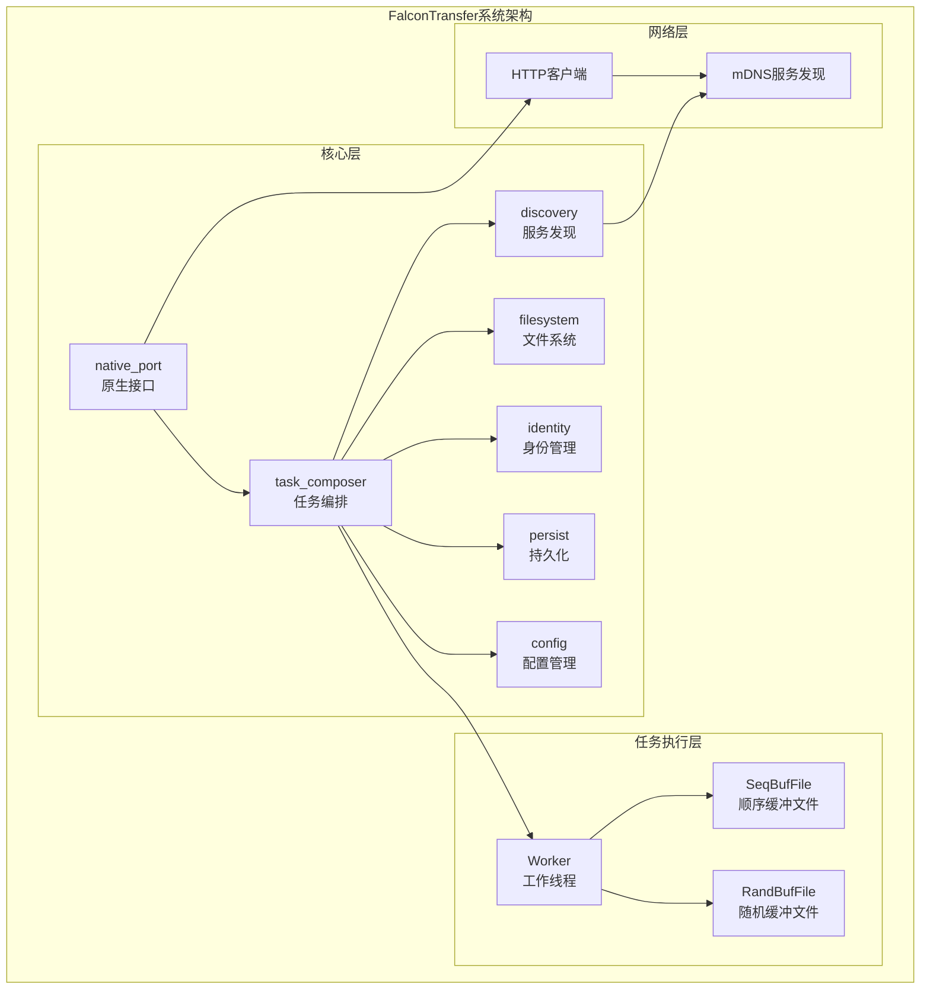
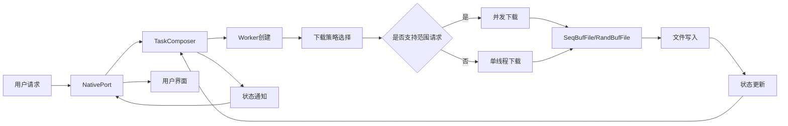

# 生成需求规格说明书Prompt

请基于以下信息为FalconTransfer项目生成一份详细的需求规格说明书，使用Markdown格式，包含表格、架构图(Mermaid)等元素，确保信息密度大且精确。

## 一、引言

### 文档目的
生成一份全面的需求规格说明书，详细描述FalconTransfer文件传输系统的技术架构、功能需求和非功能需求，为开发团队提供清晰的实现指南。

### 文档范围
本文档涵盖FalconTransfer系统的完整技术规格，包括系统架构、核心模块、API设计、数据结构和性能要求。基于以下核心代码和技术规格：

```rust
// 项目结构概览
[workspace]
members = [
  "config",        // 配置管理
  "discovery",     // 服务发现
  "filesystem",    // 文件系统抽象
  "identity",      // 身份与任务标识
  "native_port",   // 原生接口
  "persist",       // 持久化
  "task_composer", // 任务编排与调度
]
```

## 二、系统介绍

### 项目说明
FalconTransfer是一个高性能的并发文件传输系统，采用Rust语言开发，支持范围请求、并发下载和智能任务调度。核心特点包括：

1. **模块化架构**：采用Rust工作空间(workspace)结构，各模块职责明确
2. **服务发现机制**：基于mDNS协议实现自动节点发现
3. **智能任务调度**：支持并发下载、断点续传和动态速率调整
4. **高性能IO**：基于compio异步运行时和缓冲IO机制

### 项目弊端及符合标准
当前已知问题（基于README.md）：
- TAP模式下会发现自己
- 文件缓冲有时候没刷完

待实现功能：
- 持久化
- 更多控制选项
- 设置与配置
- 缓冲IO优化
- 自定义缓冲区大小
- 引入defer机制
- 代理支持
- 自定义header和UA
- 磁盘空间预先检查
- QoS支持
- 取消安全机制

## 三、架构设计

### 系统架构图
请使用Mermaid绘制以下架构图：



### 核心模块设计

#### 1. 服务发现模块 (discovery)
基于mDNS实现自动节点发现，关键代码：

```rust
// 服务发现核心代码
const SERVICE_TYPE: &str = &FULLNAME_SUFFIX[1..];
const FULLNAME_SUFFIX: &str = "._falcon_transfer._udp.local.";
const ALPN_ID: &str = "falcon-transfer-v1";

pub struct DiscoveryService {
    handle: JoinHandle<()>,
    daemon: announce::AnnounceDaemon,
    neighbors: Arc<NeighborTable>,
}

impl DiscoveryService {
    pub fn run() -> Self {
        let neighbors = Arc::new(NeighborTable::new());
        let announce = announce::AnnounceDaemon::new();
        announce.register().expect("Failed to announce");
        
        let neighbors_clone = neighbors.clone();
        let handle = spawn(async move {
            let mut discovery = pin!(listen());
            while let Some(info) = discovery.next().await {
                match info {
                    Register(resolved) => {
                        let new_addrs = resolved.addresses.into_iter()
                            .map(Into::into).collect::<Vec<ScopedAddr>>();
                        let instance_name = parse_instance_from_fullname(&resolved.fullname).unwrap();
                        neighbors_clone.entry(instance_name.into())
                            .and_modify(|old_addrs| {
                                if new_addrs != *old_addrs {
                                    *old_addrs = new_addrs.clone();
                                }
                            })
                            .or_insert(new_addrs);
                    }
                    Unregister(instance_name) => {
                        neighbors_clone.remove(&instance_name);
                    }
                }
            }
        });
        Self { daemon: announce, handle, neighbors }
    }
}
```

#### 2. 任务编排模块 (task_composer)
负责任务的创建、调度和状态管理，核心组件：

```rust
// 任务命令枚举
#[derive(Debug, Clone)]
pub enum TaskCommand {
    ChangeConcurrency { id: TaskId, concurrency: NonZeroU8 },
    ChangeRateLimited { id: TaskId, limit: Option<NonZeroU32> },
    Pause(TaskId),
    Resume(TaskId),
    Cancel(TaskId),
    Create { meta: Box<HttpTaskMeta>, watch: Box<watch::Sender<TaskStatus>> },
    Remove(TaskId),
}

// 任务元数据
#[derive(Debug, Clone)]
pub struct HttpTaskMeta {
    url: Url,
    name: SafeFileName,
    size: Option<usize>,
    mime: Mime,
    ranges_support: bool,
}
```

#### 3. 文件系统模块 (filesystem)
提供高性能的文件IO操作，支持顺序和随机访问模式：

```rust
// Worker实现多种下载模式
#[derive(Debug, TypedBuilder)]
pub struct Worker {
    id: TaskId,
    url: Url,
    file: File,
    status: watch::Sender<TaskStatus>,
    child_cancel: CancellationToken,
    rate_limit: SharedRateLimiter,
    #[builder(default, setter(strip_option))]
    assign: Option<FrozenRangeSet>,
}

impl Worker {
    const WORKER_TIMEOUT: Duration = Duration::from_mins(3);
    
    // 根据不同情况选择下载模式
    pub fn spawn(self) -> WorkerFuture {
        match self.assign {
            Some(ref rng) if rng.is_empty() => Err(mk_err(EmptyRange)),
            Some(ref rng) if rng.ranges_count() == 1 => self.download_continuous(),
            Some(_) => self.download_spare(),
            None => self.download_any(),
        }
    }
}
```

## 四、功能需求

### 1. 核心功能需求表

| 功能模块 | 功能描述 | 优先级 | 关键代码/实现点 |
|---------|---------|--------|---------------|
| 服务发现 | 基于mDNS自动发现网络中的FalconTransfer节点 | 高 | `discovery/src/lib.rs`中的`DiscoveryService` |
| 文件下载 | 支持HTTP/HTTPS协议文件下载 | 高 | `task_composer/src/http/worker.rs` |
| 并发下载 | 支持多线程并发下载同一文件的不同部分 | 高 | `task_composer/src/http/worker.rs`中的并发控制 |
| 断点续传 | 支持中断后从上次位置继续下载 | 高 | `falcon_filesystem`模块的范围处理 |
| 速率控制 | 支持下载速率限制和调整 | 中 | `utils/rate_limiter.rs` |
| 任务管理 | 创建、暂停、恢复、取消下载任务 | 高 | `task_composer/src/http/command.rs` |
| 文件系统抽象 | 提供统一的文件操作接口 | 高 | `filesystem/src/`中的缓冲文件实现 |

### 2. 详细功能规范

#### 2.1 下载任务创建与管理
基于`task_composer/src/http/meta.rs`的`HttpTaskMeta`结构：

```rust
pub struct HttpTaskMeta {
    url: Url,                    // 下载URL
    name: SafeFileName,          // 安全文件名
    size: Option<usize>,         // 文件大小(可选)
    mime: Mime,                  // MIME类型
    ranges_support: bool,        // 是否支持范围请求
}
```

需求详情：
- 支持从HTTP响应头中解析文件信息
- 自动生成安全文件名，防止路径遍历攻击
- 检测并支持范围请求能力
- 提供文件大小的可选处理

#### 2.2 工作线程与下载策略
基于`task_composer/src/http/worker.rs`的`Worker`实现：

需求详情：
- 根据文件大小和服务器支持情况，自动选择下载策略：
  - 连续下载：单个连续范围
  - 稀疏下载：多个不连续范围
  - 任意下载：未知文件大小的降级处理
- 实现超时机制：默认3分钟超时
- 支持速率限制：通过令牌桶算法控制下载速度
- 提供取消机制：支持任务中途安全取消

### 3. 数据流图
请使用Mermaid绘制数据流图：



## 五、遗留问题

### 1. 已知问题分析
基于README.md中的问题列表：

| 问题描述 | 影响范围 | 可能原因 | 建议解决方案 |
|---------|---------|---------|-------------|
| TAP模式下会发现自己 | 服务发现模块 | mDNS环回机制导致自发现 | 添加本地地址过滤，排除环回接口 |
| 文件缓冲有时候没刷完 | 文件系统模块 | 异步IO缓冲区未完全刷新 | 改进文件关闭机制，确保缓冲区刷新 |

### 2. 待实现功能详细分析

#### 2.1 持久化机制
- **目标**：实现任务状态和进度的持久化存储
- **实现点**：
  - 任务元数据序列化
  - 下载进度保存
  - 系统重启后恢复机制
- **参考代码**：`persist`模块待开发

#### 2.2 QoS控制
- **目标**：实现服务质量控制和网络优化
- **实现点**：
  - 基于网络状况的自适应调整
  - 带宽分配算法
  - 优先级调度机制
- **参考代码**：`task_composer/src/http/qos.rs`

#### 2.3 取消安全机制
- **目标**：确保任务取消过程中的数据一致性
- **实现点**：
  - 原子性操作保证
  - 资源清理机制
  - 状态同步优化
- **参考代码**：`worker.rs`中的取消令牌处理

### 3. 技术风险评估表

| 风险项 | 风险等级 | 影响模块 | 缓解措施 |
|-------|---------|---------|---------|
| 并发下载资源竞争 | 中 | filesystem | 改进锁机制，使用更细粒度锁 |
| 网络连接不稳定 | 高 | task_composer | 实现更健壮的重试机制 |
| 大文件内存占用 | 中 | worker | 优化缓冲区管理，限制内存使用 |
| 跨平台兼容性 | 中 | 全系统 | 增加平台特定测试 |

## 生成要求

1. **格式要求**：使用Markdown格式，包含表格、Mermaid图表和代码片段
2. **内容密度**：确保信息密度高，描述精确，避免模糊表述
3. **技术深度**：深入分析核心代码和架构设计，提供具体实现细节
4. **结构清晰**：按照上述标题结构组织内容，确保层次分明
5. **图表丰富**：包含架构图、流程图和状态图，增强可视化效果
6. **代码示例**：每个主要模块都应包含关键代码示例和分析
7. **表格完整**：所有表格都应完整填写，提供具体信息